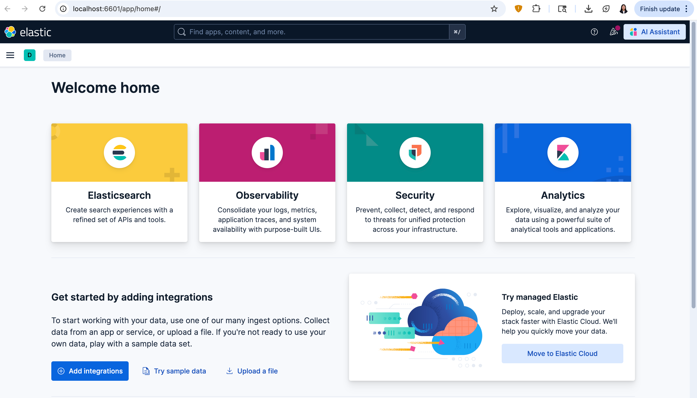
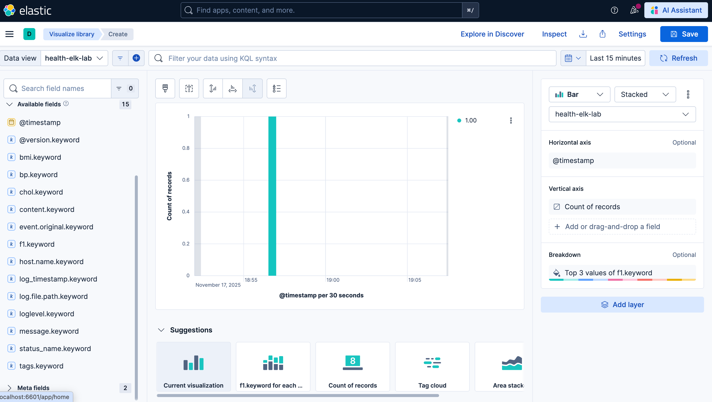

## Changes made to this lab
1. Using a new heath dataset that has BMI, Cholestrol, Blood pressure as parameters to predict chances of having a certain disease.
2. Added a new API that displays the name of the status (At Risk, Healthy, Diseased).
3. All instructions to compile and execute ELK remain the same.
---

## Overview

In this lab, you will:
- Train a Decision Tree Classifier on the custom health dataset.
- Serve the trained model using FastAPI.
- Configure Logstash to parse training logs + API logs.
- Send parsed logs into Elasticsearch.
- Use Kibana Discover to inspect logs.
- Create a visualization (e.g., F1 Score over time).
- This results in a complete ML observability pipeline.

## Setting up the lab

1. Create a virtual environment(e.g. **elk_lab**).
2. Activate the environment and install the required packages using `pip install -r requirements.txt`.

### Project structure

```
data/
    health_data.csv
logs/
    health_api.log
    health_training.log
model/
    health_model.pkl
src/
    train.py
    predict.py
    data.py
    logger_config.py
    main.py
logstash.conf
README.md

```

## Running the Lab

### 1. Set Up the Project
- Clone the repository and navigate into the ELK_Lab folder.
- Create and activate a Python virtual environment.
- Install all required Python dependencies
    ```bash
    pip install -r requirements.txt
    ```

### 2. Train the Machine Learning Model
- This generates the trained model file at model/health_model.pkl 
    ```bash
    cd src
    python train.py
    ```
- Produces our first log file at logs/health_training.log


### 3. Start the FastAPI Service
- Send a sample curl command after doing this:
    ```bash
    uvicorn main:app --reload
    ```
- Produces our second log file at logs/health_api.log

### 4. Install and Start Elasticsearch
- Download Elasticsearch from the official site: https://www.elastic.co/downloads/elasticsearch
- Edit elasticsearch.yml and disable extra system features for simplicity:
    ```bash
    xpack.ml.enabled: false
    xpack.security.enabled: false
    ```
- Start Elasticsearch
    ``` bash
    cd bin 
    ./elasticsearch
    ```
- Open Elasticsearch in your browser: http://localhost:9200
- You should see a JSON response similar to:
    ```bash
    {
      "name" : "your-macbook-name",
      "cluster_name" : "elasticsearch",
      "cluster_uuid" : "xxxxx",
      "version" : {
        "number" : "9.2.1"
      },
      "tagline" : "You Know, for Search"
    }
   ```

### 5. Install and Start Kibana
- Download Kibana from: https://www.elastic.co/downloads/kibana
- Edit kibana.yml to match your Elasticsearch config:
    server.port: 6601
    server.host: "localhost"
    elasticsearch.hosts: ["http://localhost:9200"]

- Start Kibana:
    ``` bash
    cd bin
    ./kibana
    ```
- Open it in your browser: http://localhost:6601

### 6. Run Logstash to Ship Logs into Elasticsearch
- Ensure your logstash.conf is in the project root and points to both log files:
    ``` bash
    logstash -f logstash.conf
    ```
- Logstash reads health_training.log and health_api.log and sends them to Elasticsearch under the index: health-elk-lab.

### 7. Create a Data View in Kibana Discover
- Open Kibana → Discover
- Click Create Data View
- Enter:
  - Name: health-elk-lab
  - Index pattern: health-elk-lab
  - Timestamp field: @timestamp
- Save and verify all logs are visible.



### 8. Create Visualizations in Kibana
- Go to Analytics → Visualize Library
- Create a new Lens visualization
- Select the health-elk-lab data view
- Drag fields such as f1, fp_rate, fn_rate, status_name, or loglevel onto the chart
- Save each chart after customizing the visualization type (Line, Bar, Pie, etc.)
